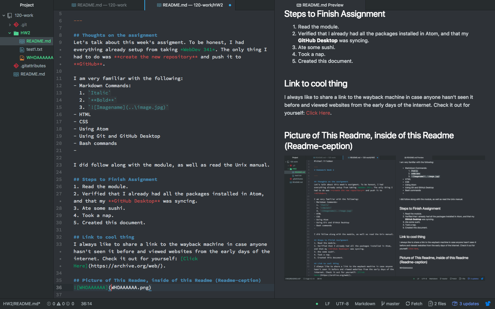

Michael Friedman

---
# Homework Week 2

---

## Thoughts on the assignment
Let's talk about this week's assigment. To be honest, I had everything already setup from taking *WebDev 341*. The only thing I had to do was **create the new repository** and push it to **GitHub**. With that being said, I am very excited to learn some Java to go along with my web development skills.

I am very familiar with the following:
- Markdown Commands:
  1. `Italic`
  2. `**Bold**`
  3. ``
- HTML
- CSS
- Using Atom
- Using Git and GitHub Desktop
- Bash commands

I did follow along with the module, as well as read the Unix manual.

## Steps to Finish Assignment
1. Read the module.
2. Verified that I already had all the packages installed in Atom, and that my **GitHub Desktop** was syncing.
3. Ate some sushi.
4. Took a nap.
5. Created this document.

## Link to cool thing
I always like to share a link to the wayback machine in case anyone hasn't seen it before and viewed websites from the early days of the internet. Check it out for yourself: [Click Here](https://archive.org/web/).

## Picture of This Readme, inside of this Readme (Readme-ception)

